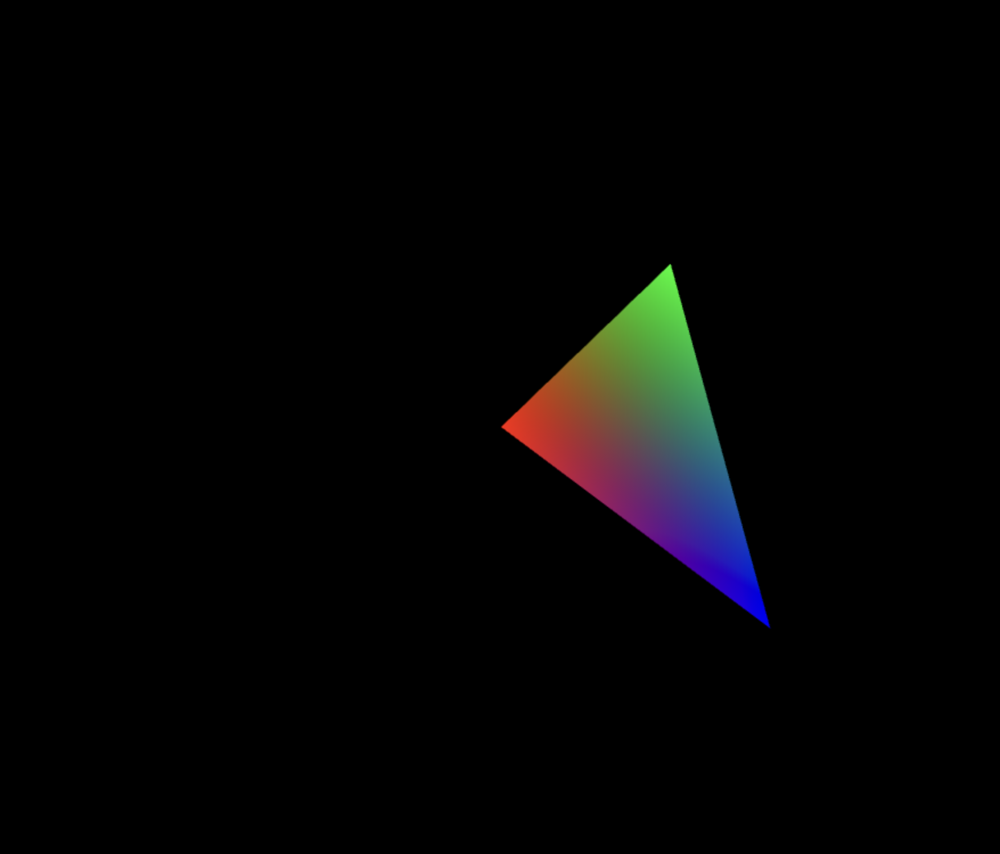

# WebGL2 From the Ground Up

A series of WebGL learning projects built from the ground up with no NPM packages, only the libraries included in the browser. Its amazing what browser comes with these days!

## 01-Triangle

> No includes, all code required to render included in the `index.js` file!

## 02-Triangle-Magic

> 01-Triangle that refactors the boilerplate into shared modules

## 03-Cube

> Creates a 3D cube spinning in space using matrix transformations, adds correct transforms to take geometry from model space to clips space.

### TODO

Current progress:

...

## Resources

[webgl2fundamentals.org](https://webgl2fundamentals.org/)